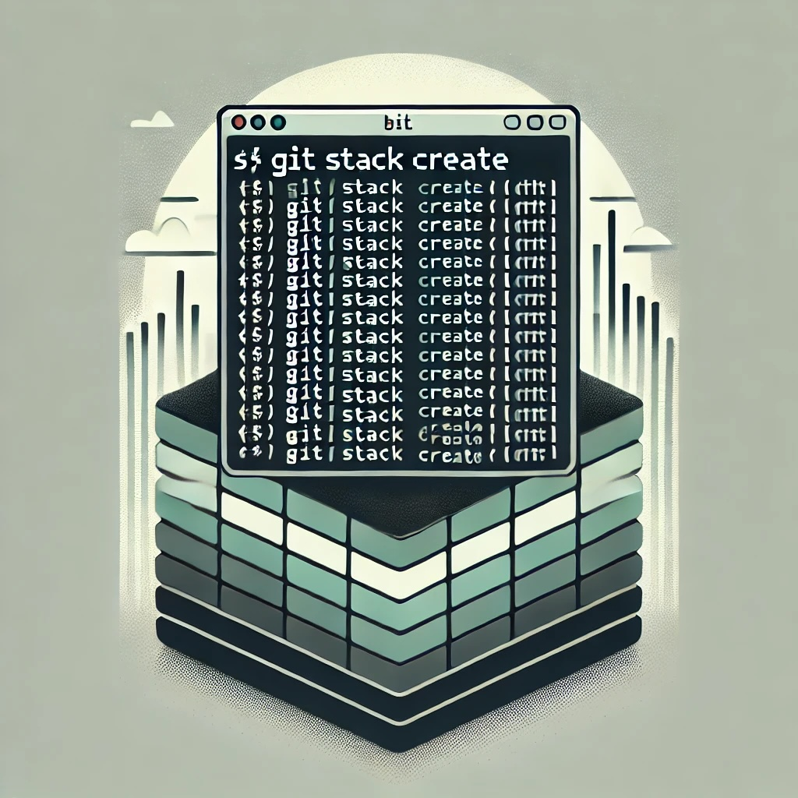

# Git Stack
## A lightweight command-line tool for effortless Git branch stack management.

[](https://github.com/dagjomar/gitstack/actions/workflows/test.yml)



<br />

## Overview

Git Stack is a simple, no-frills command-line utility that makes managing stacked Git branches quick and painless. Whether you're creating, incrementing, or cleaning up branches, Git Stack helps you stay organized with minimal effort, so you can focus on what matters—writing code.

## When Git Stack Helps

**Scenario**: Bob wants to refactor `example-file.ts`. His plan: (1) add unit tests for existing functionality, (2) refactor the inner workings, (3) add a new function with updated tests.

**With Git Stack**:
```bash
# When on main branch, make a new stack with a name:
$main > git stack create bob
> created branch "bob-0"
$bob-0 > git commit "add unit-test"
$bob-0 > git stack increment  
> created branch "bob-1"
$bob-1 > git commit "refactor file"
$bob-1 > git stack increment
> created branch "bob-2"  
$bob-2 > git commit "add functionality"
```

**Now the branch structure looks like:**
```
bob-2 (add functionality)
  |
bob-1 (refactor file)
  |  
bob-0 (add unit-test)
  |
main
```

**When Alice requests changes on the first PR:**
```bash
$bob-2 > git checkout bob-0
$bob-0 > # make Alice's requested changes
$bob-0 > git commit --amend
$bob-0 > git stack fix
> rebasing bob-1 onto bob-0...
> rebasing bob-2 onto bob-1...
> stack updated successfully
```

**Result**: Bob spends time coding, not wrestling with git. One command handles the cascade of updates across his entire dependent branch stack, keeping everything in sync while his PRs are under review.

## Features

- **Create Stacked Branches:** Easily initialize a new branch stack with a base name.

- **Increment Branches:** Quickly create subsequent branches in the stack with an incremented suffix.

- **Delete Branch Stacks:** Force-delete entire stacks of branches efficiently.

- **Push Branch Stacks:** Force-push all branches in a stack to remote with a single command.

## Installation

1. **Clone the Repository:**

   ```bash
   git clone https://github.com/yourusername/gitstack.git
   cd gitstack
   ```

2. **Make the Script Executable:**

```bash
  chmod +x bin/gitstack.sh
```

3. **Make the Script Executable:**
   To simplify usage, set up a Git alias to run the script with git stack:

```bash
  git config --global alias.stack '!bash /path/to/gitstack/bin/gitstack.sh'
```

Replace /path/to/gitstack/bin/gitstack.sh with the absolute path to gitstack.sh on your system. This alias allows you to execute the script using git stack.

## Usage

After setting up the alias, you can use the following commands:

- **Create a New Branch Stack:**

```bash
  git stack create <base_name>
```

Initializes a new branch named <base_name>-0.

- **Increment the Current Branch:**

```bash
  git stack increment
```

Creates a new branch by incrementing the current branch's suffix.

- **Delete a Branch Stack:**

```bash
  git stack delete -f <base_name>
```

Force-deletes all local branches matching <base_name>-\*.

Alternatively, to interactively delete the current branch's stack:

```bash
  git stack delete
```

This command prompts for confirmation before deleting the stack.

- **Push a Branch Stack:**

```bash
  git stack push [base_name]
```

Force-pushes all branches in a stack to the remote repository. If no base name is provided, it uses the current branch's stack.

## TODOs
- Create better usage examples and use cases explaining how to best us it in a normal workflow
- Create command to manage rebasing

## Contributing

Contributions are welcome! Feel free to submit issues or pull requests to enhance Git Stack.
